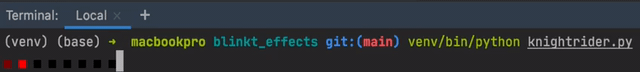

# blinkt-effects

Animated light effects for the [Pimoroni Blinkt!](https://github.com/pimoroni/blinkt).

## Docs
```
pip install -r requirements.txt
python rain.py
```
If the blinkt library is not installed (for instance when testing on PC, instead of a Raspberry Pi), 
the file `fake_blinkt.py` will be used instead, which simulates the effect by printing it to the console.



blinkt-effects includes command line bindings to quickly run an effect.  
`python ./blinkt_effects --help`

Effects can be loaded from a list of RGB values or from a PNG file. Examples can be found in `blinkt_effects/effects/` and `sprites/`.
